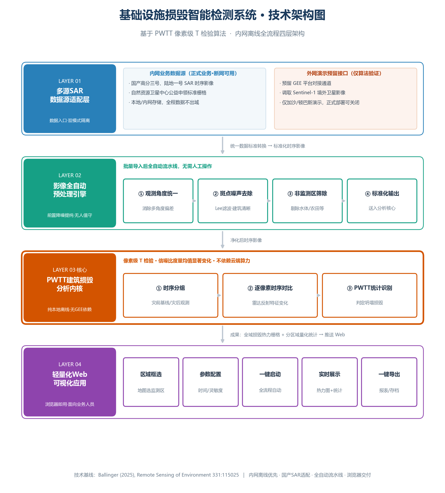

# 基础设施损毁智能检测系统 · PWTT

> 基于 [Pixel-Wise T-Test (PWTT)](https://github.com/oballinger/PWTT) 算法的建筑损毁检测项目。
> 采用**内网离线优先**的四层架构：多源 SAR 数据源 → 全自动预处理 → PWTT 分析内核 → Web 可视化。



## 📌 项目简介

本项目利用合成孔径雷达（SAR）卫星影像，通过**像素级 T 检验（PWTT）**算法自动识别冲突/灾害区域的建筑损毁。相比深度学习方法，PWTT 轻量、可泛化、无 domain shift，在未见区域优于 SOTA DL 模型。

**技术参考**：Ballinger, O. (2025). *Open access battle damage detection via Pixel-Wise T-Test on Sentinel-1 imagery*. *Remote Sensing of Environment*, 331, 115025. [DOI](https://doi.org/10.1016/j.rse.2025.115025)

## 🔧 与上游 PWTT 的关系

本项目 Fork 自 [oballinger/PWTT](https://github.com/oballinger/PWTT)（MIT License），在原基础上增强：

- **🐛 Bug 修复**：默认 `stouffer` 方法的 `make_orbit_s1` 未定义名 Bug（→ `make_group_collection`），修复后默认方法可正常运行（见 `pwtt/__init__.py`）。
- **🔑 安全认证**：新增 `gee_auth.py`，把 GEE 凭据从 C 盘默认路径 monkey-patch 重定向到项目内 `.gee/`，避免敏感信息写入系统盘。
- **📈 可视化与诊断**：新增 `view_result.py`（损毁热力图 + `n_pre` 参考期诊断，并排出图）。
- **🧪 复现测试**：新增 `test_detect.py`（最小用例验证默认 stouffer 算法可跑通）。
- **🗺 国产 SAR 适配（进行中）**：预留高分三号 / 陆地一号数据接入通道，目标内网离线运行（脱离 GEE）。
- **🌐 Web 应用**：`app.py` + `templates/` + `static/` 构建轻量化可视化前端（第四层）。

## 🏗 技术架构（四层）

| 层 | 名称 | 职责 |
|---|---|---|
| 01 | 多源 SAR 数据源适配层 | 内网业务（国产 SAR）+ 外网演示（GEE / Sentinel-1）双模式隔离 |
| 02 | 影像全自动预处理引擎 | 观测角度统一、斑点噪声去除（Lee 滤波）、非监测区筛除 |
| 03 | **PWTT 损毁分析内核** | 像素级 T 检验：逐轨道 Welch + Stouffer 加权合并 |
| 04 | Web 可视化业务应用 | 区域框选、参数配置、一键分析、结果导出 |

详见 [技术路线图.png](技术路线图.png)。

## 🚀 快速开始

### 1. 环境要求
- Python 3.10+
- Google Earth Engine 账号 + 云项目（用于 Sentinel-1 数据访问）
- 依赖：`earthengine-api`、`geemap`

### 2. 安装
```bash
git clone https://github.com/<你的用户名>/PWTT.git
cd PWTT
python -m venv .venv
# Windows PowerShell:
.\.venv\Scripts\Activate.ps1
pip install -e .
```

### 3. GEE 认证（首次）
```powershell
$env:GEE_PROJECT = "你的谷歌云项目ID"
python gee_auth.py   # 浏览器授权一次，凭据存 .gee/（已 gitignore）
```

### 4. 运行
```bash
python test_detect.py    # 最小复现：验证默认 stouffer 跑通
python view_result.py    # 生成 Gaza 损毁热力图 + n_pre 参考期诊断图
```

## 📂 目录结构
```
PWTT/
├── pwtt/__init__.py     # 核心算法（detect_damage / ttest / lee_filter ...）
├── code/                # 上游辅助脚本（eval, cusum, threshold_curves ...）
├── gee_auth.py          # GEE 认证（凭据重定向到 .gee/）
├── test_detect.py       # 最小复现
├── view_result.py       # 热力图 + n_pre 诊断
├── gen_roadmap.py       # 技术架构图生成
├── 技术路线图.png        # 四层技术架构图
├── app.py               # Web 应用入口（第四层）
├── templates/ static/   # Web 前端
├── pyproject.toml       # 包配置
├── .gitignore           # 忽略 .venv/ .gee/ memory/ 等
└── readme.md            # 上游英文 README
```

## 🤝 协作流程

欢迎贡献！推荐 GitHub Flow：

```bash
# 1. 同步最新
git pull

# 2. 新建功能分支
git checkout -b feature/你的功能

# 3. 改代码并提交
git add <文件>
git commit -m "feat: 简述改动"

# 4. 推送
git push -u origin feature/你的功能

# 5. 在 GitHub 发起 Pull Request，团队 review 后合并到 main
```

**提交信息约定**：`feat:` 新功能 / `fix:` 修复 / `docs:` 文档 / `refactor:` 重构 / `chore:` 杂项。

## 📄 许可

MIT License —— 继承自上游 [oballinger/PWTT](https://github.com/oballinger/PWTT)。

## 🙏 致谢

- 算法与基础代码：[Ollie Ballinger](https://github.com/oballinger) 的 PWTT 项目与论文
- 建筑损毁标注：联合国卫星中心 UNOSAT
- 卫星影像：ESA Copernicus Sentinel-1、Google Earth Engine
